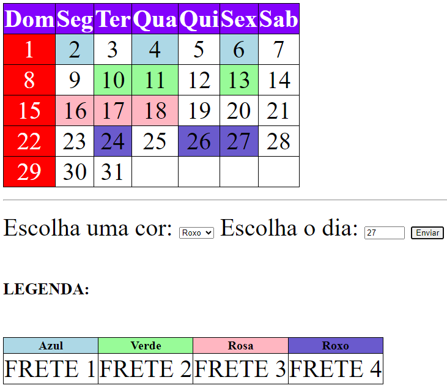
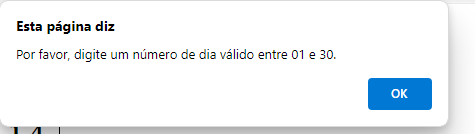

# Calendario
 
* [Clendário](#Calemdario)
* [Descrição](#descrição)
* [Introdução](#introdução)
* [Funcionalidades](#funcionalidades)
* [Tecnologias Utilidades](#tecnologias-utilizadas)
* [Fontes Consultadas](#fontes-consultadas)
* [Autores](#autores)
 
# Calendário
 
## Descrição 📖
- O projeto consiste em desenvolver um calendário interativo utilizando JavaScript, HTML5 e CSS3 para a empresa Alpha, com o objetivo de facilitar o agendamento de fretes para os veículos da frota. Cada veículo é identificado por uma cor específica e tem limitações quanto ao número de fretes por dia e por mês. A solução proposta permite ao colaborador da área de agendamento registrar os dias em que cada veículo realizará o frete, garantindo que as regras de agendamento sejam respeitadas.
 
## Introdução ✉️
A área de agendamento de fretes da empresa Alpha enfrenta o desafio de otimizar o uso da frota de veículos, garantindo que cada veículo seja alocado de forma eficiente, respeitando as restrições de disponibilidade e capacidade de cada um. Para isso, desenvolvemos um sistema de calendário que permite o agendamento dos fretes de maneira intuitiva, dando um alerta na tela do usuário quando é digitado um número menor que 1 ou maior que 30 (ex: -5, -2, 0, 35, 40). Facilitando o trabalho dos colaboradores e garantindo o cumprimento das regras estabelecidas pela empresa.

 
## Funcionalidades 🧠
-  Marcação de dias no calendário para agendamento de fretes.
- Atribuição de cores aos dias conforme o veículo responsável pelo frete.
- Legenda para identificação das cores dos veículos.
- Restrições de agendamento respeitadas: cada veículo pode fazer no máximo um frete por dia e três fretes por mês.
- Interface amigável e responsiva, desenvolvida com HTML5 e estilizada com CSS3.
 
## Tecnologias Utilizadas 🖥️  
- Visual Studio Code;
- CSS3;
- Github;
- Git;
- HTML5;
- JavaScript.
 
## Autores 👥
- Github: [Nicolas Tonassi](https://github.com/nicolas-tonassi); LinkedIn: [Nicolas Tonassi](https://www.linkedin.com/in/nicolas-tonassi-b70a50261?utm_source=share&utm_campaign=share_via&utm_content=profile&utm_medium=android_app)
- [Murilo Tonassi](https://github.com/murilo-tonassi)
- [Pamela Souza](https://github.com/PamelaSouzaSilva)